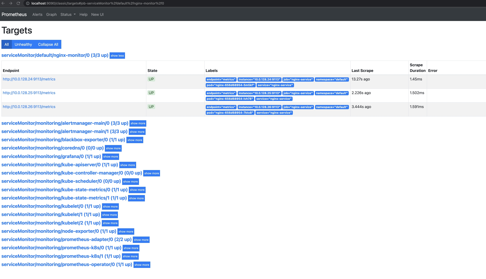
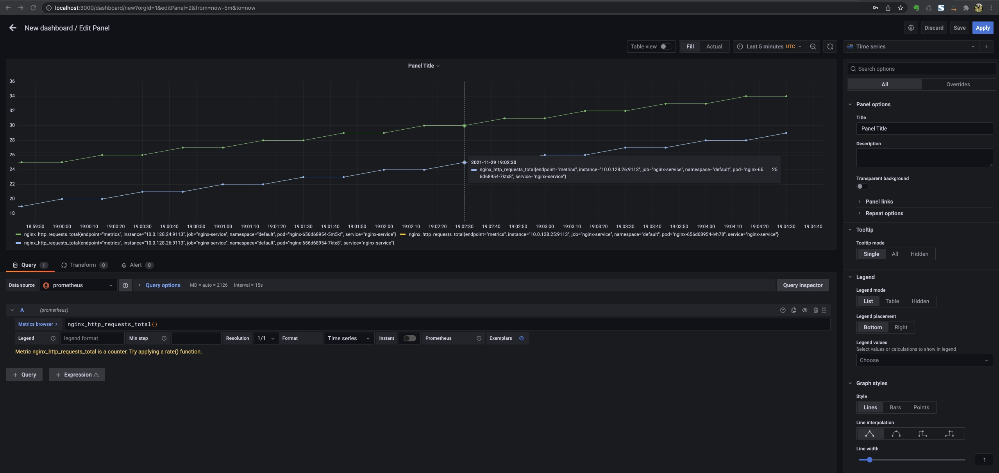

##Kubernetes-monitoring
1. Деплоим NGINX
  - `kubectl apply -f kubernetes-monitoringconfigmap.yaml`
  - `kubectl apply -f kubernetes-monitoringdeployment.yaml`
2. Устанавливаем мониторинг по В.2 (git clone https://github.com/prometheus-operator/kube-prometheus.git)

    `kubectl create -f manifests/setup`
    `kubectl create -f manifests/`

3. Применяем манифесты для снятия метрик:

    `kubectl apply -f kubernetes-monitoring/service.yaml`

    `kubectl apply -f kubernetes-monitoring/monitoring.yaml`

4. Смотрим в prometheus

    `kubectl port-forward -n monitoring svc/prometheus-k8s 9090`
    `kubectl port-forward -n monitoring svc/grafana 3000`

